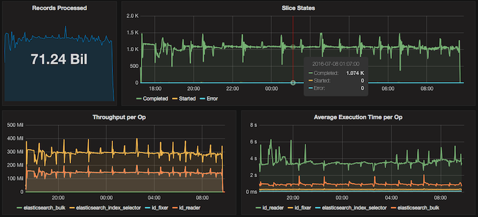

Teraslice provides scalable data processing pipelines implemented using components written in JavaScript. It uses a distributed model to spread work across a cluster of computers and can easily process millions of records per second.

The architecture is open and can be used with any data source and type of data. Most common use cases currently include ingest, validation, transformation and routing of data between Kafka and Opensearch clusters.

Data processing pipelines are defined as Jobs that link together processors that do the actual work. Processors are small JavaScript components that are intended to be reusable data processing operations.

Processors are collected together into libraries we call Asset Bundles which can then be easily reused across jobs. Jobs will typically use a combination of pre-built generic Processors and custom developed application specific Processors to solve a particular problem. We have pre-built [asset bundles](asset-bundles.md) for Opensearch, Kafka, Files and a Standard library of data transformation tools.

For large scale production deployment Teraslice runs on Kubernetes and for smaller deployments has simple built in clustering.

Here are a few tasks it has been used for:

- Data ingest from Kafka to Opensearch
- Synchronizing Kafka Topics between clusters
- Data transformation between Kafka Topics
- Re-indexing Opensearch data at very high volumes
- Copying and transforming Opensearch data between clusters
- Moving data out of Opensearch into other systems
- Automatic syncing of data from Opensearch to other systems
- Exporting data to files
- Importing data from files stored in Amazon S3 compatible data stores
- Periodic processing of data stored in an Opensearch index

The graphs below come from a high volume Opensearch re-indexing job. This Job copied 71.24 Billion records from a single Opensearch cluster, performed some data cleanup and transformation and then wrote the data out to an array of 8 Opensearch clusters. Total runtime on the job was 13 hours with an average throughput of 1.5 Million records per second. Without Teraslice, reliably moving this amount of data out of Opensearch simply wouldn't have been possible.

[Watch the Getting Started video](https://www.youtube.com/watch?v=TG7flPTZeeg)

## Status

Teraslice is currently in alpha status. Single node deployment, native clustering and Kubernetes support are all stable. APIs are mostly stable but will still be evolving as we work toward a production release. See the list of open issues for other limitations.
