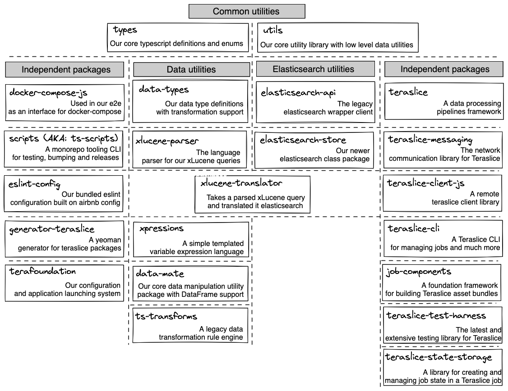

Teraslice is a monorepo made up of many packages. Packages that have been deprecated or are no longer recommended for use live under "Legacy". Packages that are not designed to be used outside of teraslice repo are under "Internal".

To develop a package, checkout the [development docs](./development/overview.md)

